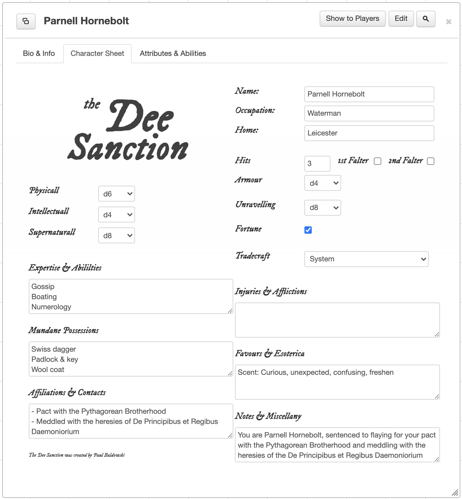

# the-dee-sanction-roll20
My ersatz Roll20 character sheet for The Dee Sanction RPG. Until there's an official one.

This requires you to be able to use custom character sheets on Roll20, and hence have a "Pro" Roll20 account I believe.

Assuming you have that ability, you can use this character sheet by creating a game and choosing "custom" for the character sheet template.
If you click on your new game, you should be presented with a "settings" option, in which you should hopefully see a "Character Sheet Template" section.
You can simply paste the two files (html and css) into the two appropriate tabs and click "Save Changes". 

I created this to use purely in my own home game of The Dee Sanction, but am providing it publicly in case it's of use to anyone.

I've used the closest font I can find to that used in the draft PDF of the rulebook for the game logo. It's the closest I can find on Google Fonts. Let me know if you find a better one.

I also added a "Notes & Miscellany" box, so players would have somewhere to jot random notes, and for me to paste in the output from @MrGarland4 on Twitter.

### TODO:

(See the "Issues" linked above)
